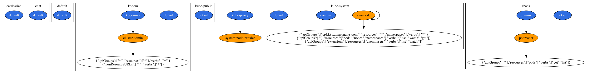

# rback

A simple `RBAC in Kubernetes` visualizer.

## Install

Dependencies:

- Access to a Kubernetes cluster
- `kubectl` installed and configured

Download and install `rback`:

```sh
$ curl -L ...
```

## Usage

### Online

There are plenty of Graphviz (`dot`) online visualization tools available, for example [dreampuf.github.io/GraphvizOnline](https://dreampuf.github.io/GraphvizOnline/). Head over there and paste the output of `rbac` into it, for example:



### Local

Install [Graphviz](https://www.graphviz.org/), for example, on macOS you can do `brew install graphviz`. Then you can do the following (on macOS):

```sh
$ rback | dot -Tpng  > /tmp/rback.png && open /tmp/rback.png
```
